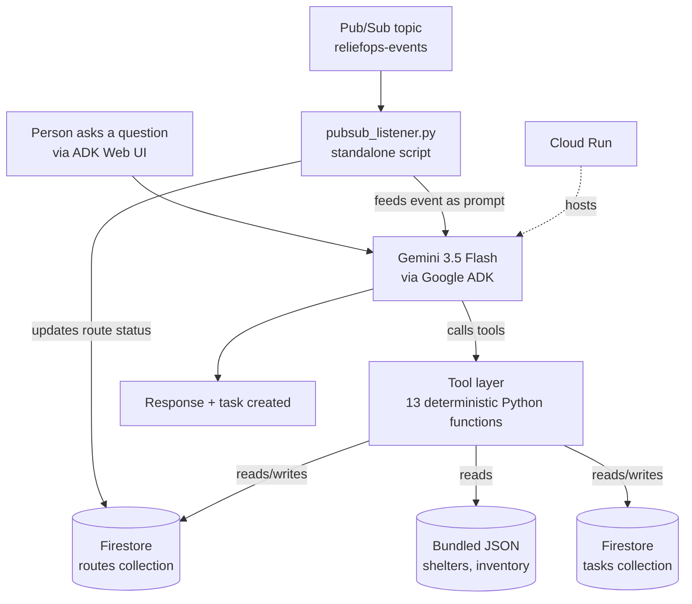

# ReliefOps Agent

Autonomous disaster-response operations agent built for the **All Things Agentic Hackathon**, Taskmaster track.

ReliefOps ingests shelter, inventory, and route conditions, calculates a deterministic priority score per shelter, drafts a supply allocation plan, checks it against a human-approval policy, creates a tracked task, and automatically replans when it receives a live event (such as a road closure) with no one re-prompting it.

**Live demo:** https://reliefops-agent-service-40369216840.us-central1.run.app

## Architecture



Shelters and inventory are read-only reference data for this prototype, bundled as JSON inside the container. Routes and tasks are mutable at runtime, so both live in Firestore, shared across every Cloud Run instance and the Pub/Sub listener.

## Tech stack

- **Model:** Gemini 3.5 Flash, via Vertex AI (`GOOGLE_GENAI_USE_ENTERPRISE=TRUE`)
- **Agent framework:** Google ADK (`google-adk`)
- **Google Cloud services:** Cloud Run, Firestore, Pub/Sub, Vertex AI
- **Language:** Python 3.12

## Tools

| Tool | Purpose |
|---|---|
| `get_shelter_status` | Status of one named shelter |
| `get_shelters` | Status of all shelters, for comparison |
| `calculate_shelter_shortage` | Deterministic water/meal shortage math |
| `get_inventory` | Warehouse stock levels |
| `check_resource_availability` | Whether warehouse can cover a requested amount |
| `get_routes` / `get_route_status` | Route status, all or one |
| `find_available_route` | First open route to a destination |
| `calculate_priority` | Weighted 0-100 priority score (35% occupancy, 25% water, 20% food, 10% medical, 10% accessibility) |
| `create_allocation_plan` | Composes shortage + inventory + route into a recommendation |
| `request_approval` | Applies approval policy (20% stock threshold, route risk, partial coverage) |
| `create_task` / `update_task` | Persists and updates tracked tasks in Firestore |

## Known limitations, disclosed on purpose

- **Medical risk** is a fixed 0 in the priority formula, no per-shelter medical data source exists yet, only warehouse-level `medical_kits`. The agent will say so if asked, it does not invent a number.
- **Incident tracking** is not yet wired up, `incidents.json` exists but nothing writes to it.
- Route data originally only covered Shelter B; Shelter A and C routes were added later in `seed_routes.py`.

## Setup / spin-up instructions

### 1. Google Cloud project setup

```bash
gcloud config set project YOUR_PROJECT_ID
gcloud services enable aiplatform.googleapis.com run.googleapis.com \
  artifactregistry.googleapis.com cloudbuild.googleapis.com \
  firestore.googleapis.com pubsub.googleapis.com

gcloud firestore databases create --location=us-central1 --type=firestore-native
gcloud pubsub topics create reliefops-events
gcloud pubsub subscriptions create reliefops-events-sub --topic=reliefops-events
```

### 2. Local environment

```bash
git clone https://github.com/likitha-sree-data/reliefops-agent.git
cd reliefops-agent
python3 -m venv venv
source venv/bin/activate
pip install -r reliefops/requirements.txt
pip install google-cloud-pubsub python-dotenv
```

Copy `reliefops/.env.example` to `reliefops/.env` and fill in your project ID:

```bash
cp reliefops/.env.example reliefops/.env
```

Seed Firestore with starting route data:

```bash
python3 seed_routes.py
```

### 3. Run locally

```bash
adk run reliefops
```

or, for the browser UI with a live tool-call trace view:

```bash
adk web
```

### 4. Deploy to Cloud Run

```bash
adk deploy cloud_run \
  --project=YOUR_PROJECT_ID \
  --region=us-central1 \
  --service_name=reliefops-agent-service \
  --with_ui \
  reliefops \
  -- \
  --allow-unauthenticated \
  --set-env-vars=GOOGLE_GENAI_USE_ENTERPRISE=TRUE,GOOGLE_CLOUD_PROJECT=YOUR_PROJECT_ID,GOOGLE_CLOUD_LOCATION=global
```

### 5. Run the Pub/Sub listener (autonomous replanning demo)

```bash
python3 pubsub_listener.py
```

In a second terminal, simulate a road closure:

```bash
gcloud pubsub topics publish reliefops-events \
  --message '{"event_type": "road_closure", "route": "Route A"}'
```

The agent will detect the closure, update Firestore, and reason about the impact with no one asking it a question directly.

### 6. Run tests

```bash
python3 test_scenarios.py
python3 test_scenario_3.py
```

## Project structure
